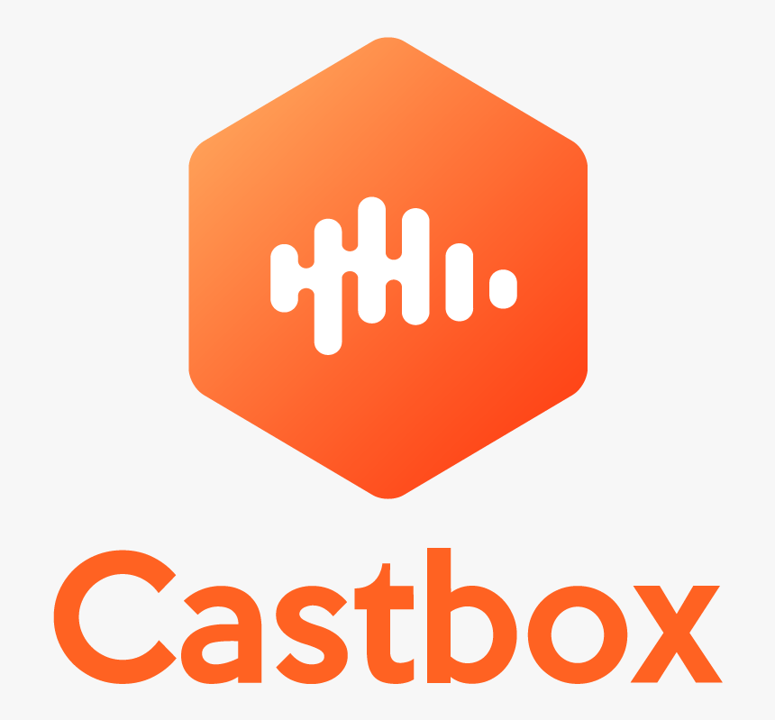

# techdigitalnews
Portfólio Podcast

require "Colaboracão""

# Portfólio Podcast - TechDigital News

Espaço para colaboração em assuntos acadêmicos sobre engenharia, computação e controle de sistemas

## Conheça nosso portfólio 

https://open.spotify.com/show/01w0vZrR8vts8jnWugpHNW

link 2

https://castbox.fm/channel/id3464793?utm_source=website&utm_medium=dlink&utm_campaign=web_share&utm_content=TechDigital%20News-CastBox_FM


<header id="headerContainer" class="Header__header Header__defaultContent"><div class="Header__navbar" id="navBar"><div class="Header__container" id="navBarContainer"><div class="Header__logo"><a data-id="portal_linback_url" href="https://castbox.fm/channel/TechDigital-News-id3464793?utm_source=website&utm_medium=dlink&utm_campaign=web_share&utm_content=TechDigital%20News-CastBox_FM"></a></div><div data-id="portal_name" title="Castbox" <svg class="Icon__icon commonStyle__positionRel commonStyle__verticalMiddle Icon__medium Icon__white"> <use xlink:href="#search"></use></svg></span><!-- react-empty: 8 --></div></div></div></div></header>

abc

 (https://open.spotify.com/show/01w0vZrR8vts8jnWugpHNW
)

123


123


Use the package manager [pip](https://pip.pypa.io/en/stable/) to install foobar.

```bash
pip install foobar
```

## Usage

```python
import foobar

foobar.pluralize('word') # returns 'words'
foobar.pluralize('goose') # returns 'geese'
foobar.singularize('phenomena') # returns 'phenomenon'
```

## Contributing
Pull requests are welcome. For major changes, please open an issue first to discuss what you would like to change.

Please make sure to update tests as appropriate.


## License
[MIT](https://choosealicense.com/licenses/mit/)
